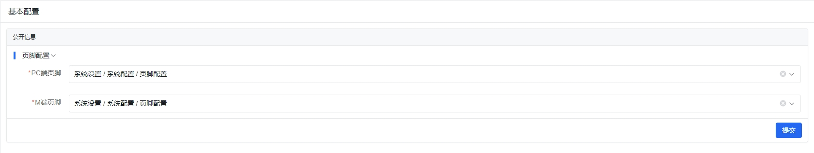
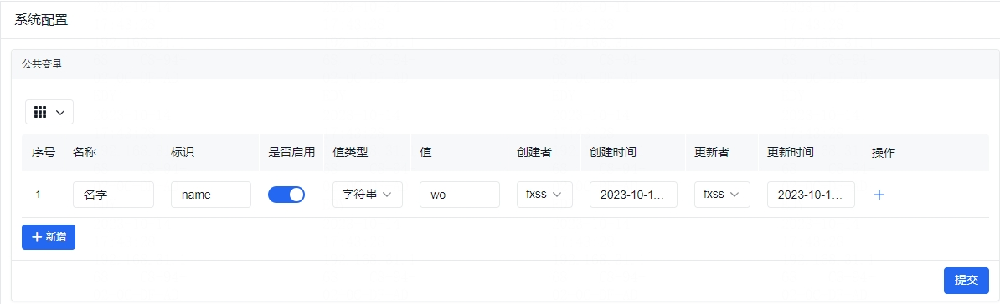
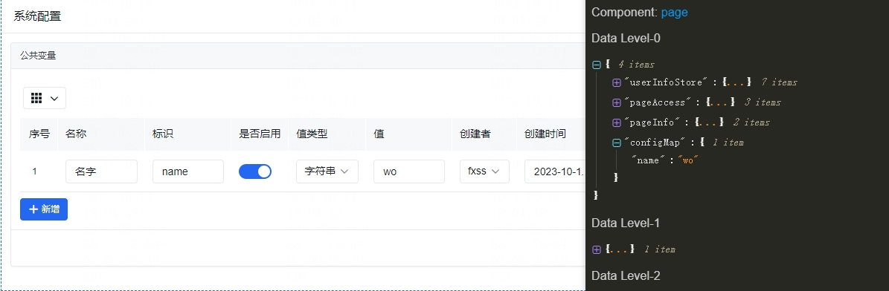

## 基本配置

基本配置主要用于系统外观的一些配置。

**注意：基本信息内规划有公开信息和非公开信息，只有公开的信息会在页面初次访问的时候拿到，并注入数据作用域，非公开的信息不会在接口返回。**

### 页脚配置

新建页面，用于页脚配置，注意用于页脚配置的页面必须**启用且对外**（不要配置隐私内容），然后在 **系统设置** / **系统配置** / **基本配置** / **页脚配置** 选择对应的页面即可。

## 公共变量

在项目开发的时候，我们经常会设置一些公共变量，以在项目所有的地方进行使用。

左侧菜单 **系统设置** / **系统配置** / **公共变量** 页面内可以配置公共变量。

在这里可以新增配置，配置的标识请使用 英文命名 方式，标识对应下面使用中 `${configMap.x}` 的 `x` ，值类型支持字符串、数值、json，当值类型为 json 格式的时候，输入的值需要自行保证符合 json 格式，否则取值接口会报错。

**只有启用的配置才能在页面中正常使用，尽量不要删除，系统不做变量是否在使用的检测**。

**公共变量不要保存加密隐私信息。**

**公共变量保存成功之后，会自动刷新页面以把公共变量注入到全局。**

### 公共变量的使用

启用的公共变量可以在 [数据链](https://aisuda.bce.baidu.com/amis/zh-CN/docs/concepts/datascope-and-datachain#%E6%95%B0%E6%8D%AE%E9%93%BE) 上查找到 公共变量 信息 `configMap` :

可以在页面中 `${configMap.x}` (x 代表 key 值) 使用。

## 成功回调

成功回调是用于在低代码中某些操作结束之后，无对应的操作事件去执行[系统方法](./abutment.md#系统方法)时，可以在 **系统设置** / **系统配置** / **成功回调** 内进行配置，配置启用的接口会在调用成功之后，去调用系统方法来达到更新系统数据的目的。

### 成功回调配置的内容

1. 接口前缀：选择接口对应的前缀，前缀取自配置的 [axiosBaseURL](./../config/web.md#axiosbaseurl) ；
2. 接口链接：接口是由类似 `${域名信息}${接口前缀}${接口链接}` 组成，**注意接口链接需要带`/`**；
3. 事件集：对应上面的系统方法，有 请求用户信息、请求系统配置、请求菜单、请求正式环境菜单、请求测试环境菜单、请求成功回调 等事件供选择，选择的事件集会在对应接口成功之后进行依次执行；
4. 是否启用：只有启用的才会在接口成功之后执行，未启用的不执行。
