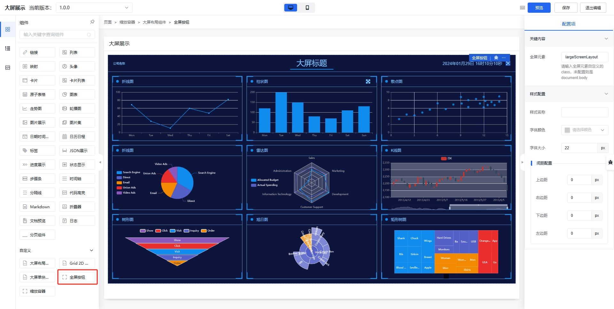

## 人人都可配置的大屏可视化

大屏主要是为了展示数据和酷炫的效果，布局大部分是9宫格，或者在9宫格上做的延伸，现在介绍下 泛积木-低代码 提供的大屏可视化配置。

首先查看效果展示 [泛积木-低代码大屏展示](https://jimu.fxss.work/#/outside/echartBigPage2)。


创建页面之后，点击进入编辑页面，在可视化编辑器左侧组件往下翻，找到自定义组件中的 **大屏布局组件** ，将 大屏布局组件 拖入页面，可以看到下面的成果：


拖入的 大屏布局组件 将使用基础配置，并且已经自带了缩放容器组件。

### 缩放容器组件


缩放容器组件主要用于适配不同的尺寸大小，实现原理：**缩放容器组件是以该组件的宽度和设计稿的宽度求比例，然后等比例缩放**。

缩放容器组件支持配置 设计稿宽度、设计稿高度、样式名称、背景颜色，当要适配不同尺寸的屏幕时，我们只需要修改 设计稿宽度、设计稿高度 为对应尺寸即可。样式名称是添加您需要设置的 [样式](https://aisuda.bce.baidu.com/amis/zh-CN/style/index) 或添加唯一的`className`，`className`作用的元素将作为后续全屏按钮点击时全屏的元素。

### 全屏按钮组件



全屏按钮组件主要用于配置全屏按钮加全屏元素等。在全屏元素中配置 缩放容器组件 的 唯一`className` 。

全屏按钮组件还支持配置 样式名称、字体颜色、字体大小、间距。字体颜色未配置时，会默认从 大屏布局组件 的字体颜色继承。

说完上述两个小组件之后，我们再来说说关键的 大屏布局组件。

### 大屏布局组件


大屏布局组件的配置项可以概括为两部分：

1. 总体配置：
   1. 总体内容：
      1. 样式名称；
      2. 字体颜色；
      3. 背景颜色；
      4. 背景图片（不想写链接，也可以直接上传）；
      5. 是否显示头部；
      6. 模块样式模板；
      7. 样式覆盖；
   2. 页面内容：
      1. 样式名称；
      2. 内间距；
2. 头部配置：
   1. 头部总体配置：
      1. 标题名称；
      2. 头部背景图片（支持上传）；
      3. 样式名称；
   2. 头部左侧：
      1. 左侧内容；
      2. 样式名称；
   3. 头部右侧：
      1. 右侧内容；
      2. 样式名称；
   4. 头部时间：
      1. 是否显示；
      2. 字体大小；
      3. 显示格式。

**样式覆盖** 填入 css 之后，会自动在组件内创建 `style` 标签添加样式，这个时候需要使用 css 优先级去覆盖默认展示内容，例如：

``` css
.large-screen-layout .large-screen-layout-header {
  height: 100px;
}
```

此时页面头部的高度将由默认的 80px 调整为 100px 。

**头部背景图片** 未设置时，头部高度默认为 80px ，设置之后，高度为背景图片按照宽度整体缩放之后的高度。

**头部左/右侧内容** 是配置 [SchemaNode](https://aisuda.bce.baidu.com/amis/zh-CN/docs/types/schemanode) , SchemaNode 是指每一个 amis 配置节点的类型，支持模板、Schema（配置）以及SchemaArray（配置数组）三种类型。

例如：

```json
{
  ...
  "headerLeft": {
    "type": "tpl",
    "tpl": "公司名称",
    "id": "u:3dc2c3411ae1"
  },
  "headerRight": {
    "type": "fan-screenfull-button",
    "targetClass": "largeScreenLayout",
    "fontSize": "22px",
    "id": "u:be46114da702"
  },
  ...
}
```

**模块样式模板** 用于统一设置 大屏单块模板组件 的样式模板，样式模板是事先定义好的一些简单样式。

### 大屏单块模板组件


大屏单块模板组件 是用于配置大屏每块内容，大屏布局组件 和 大屏单块模板组件 之间还有一层 [grid-2d 组件](https://aisuda.bce.baidu.com/amis/zh-CN/components/grid-2d)。


**grid-2d 组件** 是使用 [grid](https://developer.mozilla.org/zh-CN/docs/Web/CSS/grid) 布局，支持配置 外层 Dom 的类名、格子划分、格子垂直高度、格子间距、格子行间距，建议 大屏布局组件 -> 总体配置 -> 页面内容 -> 内边距 和格子间距设置一致，格子划分 指定 划分为几列，格子间距统一设置横向和纵向的间距，格子行间距可以设置横向间距，优先级高于格子间距。

格子垂直高度 = (缩放容器组件的设计稿高度 - 大屏布局组件头部高度 - 大屏布局组件头部高度页面内容内边距 * 2 - (格子行间距 || 格子间距) * 2) / 3

例如默认的： (1080 - 80 - 20 * 2 - 20 * 2) / 3 = 306.667px

大屏单块模板组件 支持如下配置：

1. 总体内容：
   1. 样式名称；
   2. 样式模板；
   3. 位置配置；
      1. 起始位置X;
      2. 起始位置Y;
      3. 宽度W;
      4. 高度H;
   4. 是否显示头部；
   5. 样式覆盖；
2. 模块标题：
   1. 标题名称；
   2. 标题样式；
   3. 字体颜色；
3. 模块头部右侧：
   1. 右侧内容；
   2. 样式名称；
4. 模块内容：
   1. 样式名称；
   2. 内边距。

**样式覆盖** 填入 css 之后，会自动在组件内创建 `style` 标签添加样式，这个时候需要使用 css 优先级去覆盖默认展示内容，例如：

``` css
.fan-screen-card .fan-screen-card-header {
  height: 80px;
}
```

此时模块头部的高度将由默认的 50px 调整为 80px 。 css 会作用于符合 css 的所有DOM元素，如果需要唯一设置，请在前面添加特殊的前缀，例如：


```css
.fan-screen-card-1.fan-screen-card .fan-screen-card-header {
  height: 80px;
}
```

**样式模板** 可单独设置每个模块的样式。

**模块头部右侧内容** 是配置 [SchemaNode](https://aisuda.bce.baidu.com/amis/zh-CN/docs/types/schemanode) , SchemaNode 是指每一个 amis 配置节点的类型，支持模板、Schema（配置）以及SchemaArray（配置数组）三种类型。

**位置配置** 每项的值都是数值，比如默认的 9 宫格就是 3 * 3，此时设置的值就是 1/2/3 ，宽度1就代表一列，高度1就代表一行。可以调整初始位置、宽度、高度等配置出多种布局方式。

**大屏单块模板内容**首先嵌套 [Service 功能型容器](https://aisuda.bce.baidu.com/amis/zh-CN/components/service) 用于获取数据，再使用 [Chart 图表](https://aisuda.bce.baidu.com/amis/zh-CN/components/chart) 进行图表渲染。

如果需要轮流高亮 Chart 图表的每个数据，例如 [大屏动态展示](https://jimu.fxss.work/#/outside/echartBigPage2) 可以使用如下配置：

1. 在 [Chart 图表](https://aisuda.bce.baidu.com/amis/zh-CN/components/chart) 上添加唯一的 `className` ；
2. 配置 Chart 图表的 `config` ；
3. 配置 Chart 图表的 `dataFilter`。

**`dataFilter`**：

```js{1,12-17,22-39}
const curFlag = 'lineCharts';

if (window.fanEchartsIntervals && window.fanEchartsIntervals.get(curFlag)) {
  clearInterval(window.fanEchartsIntervals.get(curFlag)[0]);
  window.fanEchartsIntervals.get(curFlag)[1] && window.fanEchartsIntervals.get(curFlag)[1].dispose();
}

const myChart = echarts.init(document.getElementsByClassName(curFlag)[0]);
let currentIndex = -1;
myChart.setOption({
  ...config,
  series: [
    {
      ...config.series[0],
      data: data.line
    }
  ]
});
const interval = setInterval(function () {
  const dataLen = data.line.length;
  // 取消之前高亮的图形
  myChart.dispatchAction({
    type: 'downplay',
    seriesIndex: 0,
    dataIndex: currentIndex
  });
  currentIndex = (currentIndex + 1) % dataLen;
  // 高亮当前图形
  myChart.dispatchAction({
    type: 'highlight',
    seriesIndex: 0,
    dataIndex: currentIndex
  });
  // 显示 tooltip
  myChart.dispatchAction({
    type: 'showTip',
    seriesIndex: 0,
    dataIndex: currentIndex
  });
}, 1000);

if (window.fanEchartsIntervals) {
  window.fanEchartsIntervals.set(curFlag, [interval, myChart]);
} else {
  window.fanEchartsIntervals = new Map();
  window.fanEchartsIntervals.set(curFlag, [interval, myChart]);
}

return config;
```

修改高亮行 1 `curFlag` 设置为对应的 Chart 图表的 `className`，12-17 行是插入数据，22-39 为对应数据的切换展示方式。


当添加第二个 大屏单块模板 时，直接把第一个复制一份，调整位置、service组件的接口、dataFilter配置等。

至此大屏就配置完成了。

<AutoCatalog />
