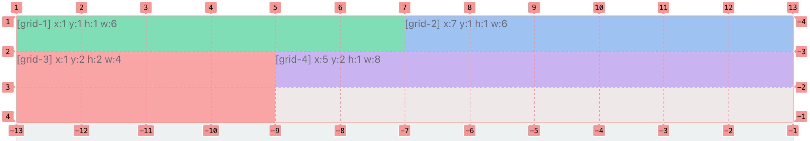

## 大屏布局组件

大屏布局组件是大屏的关键组件，从左侧组件库内拖拽进入页面的时候，会默认在外层包裹[缩放容器组件](./scaleBox.md)（用于适配不同尺寸），并支持页面头部布局的多样化配置。


## 属性表

### 总体配置

#### 总体内容

|名称|字段|用途|默认值|类型|
|----|----|----|----|----|
|样式名称|`className`|定义样式，配置在`large-screen-layout`DOM元素上| - |`string`|
|字体颜色|`fontColor`|统一设置字体颜色| #7ac4ff |`string`|
|背景颜色|`backgroundColor`|设置背景颜色| - |`string`|
|背景图片|`backgroundImage`|设置背景图片| - |`string`|
|是否显示头部|`headerShow`|设置`false`的话，页面标题、页面头部左侧/右侧、页面头部时间都不显示| `true` |`boolean`|
|模块样式模版|`classStyle`|统一设置大屏单块模板的样式模版| `fan-screen-card-2`（边框版） |`string`|
|样式覆盖|`layoutStyle`|填写css，通过css优先级直接调整覆盖页面样式| - ||

##### 样式覆盖 `layoutStyle`

样式覆盖 `layoutStyle` 是通过css优先级直接调整覆盖页面样式，例如：

``` css
.large-screen-layout .large-screen-layout-header {
  height: 100px;
}
```

#### 页面内容

|名称|字段|用途|默认值|类型|
|----|----|----|----|----|
|样式名称|`bodyClassName`|定义样式，配置在`large-screen-layout-body`DOM元素上| - |`string`|
|内边距|`bodyPaddingSize`|定义内边距，优先级高于样式名称| 20 |`number`|

### 头部配置

#### 头部总体配置

|名称|字段|用途|默认值|类型|
|----|----|----|----|----|
|标题名称|`headerTitle`|标题名称| 大屏标题 |`string`|
|头部背景图片|`headerBackgroundImage`|头部背景图片| - |`string`|
|样式名称|`headerTitleClassName`|定义样式，配置在`large-screen-layout-header_title`DOM元素上| - |`string`|

#### 页面头部左侧

|名称|字段|用途|默认值|类型|
|----|----|----|----|----|
|左侧内容|`headerLeft`|标题名称，配置[schemanode](https://aisuda.bce.baidu.com/amis/zh-CN/docs/types/schemanode)|-|`json`|
|样式名称|`headerLeftClassName`|定义样式，配置在`large-screen-layout-header_left`DOM元素上| - |`string`|

#### 页面头部右侧

|名称|字段|用途|默认值|类型|
|----|----|----|----|----|
|右侧内容|`headerRight`|头部右侧，配置[schemanode](https://aisuda.bce.baidu.com/amis/zh-CN/docs/types/schemanode)|-|`json`|
|样式名称|`headerRightClassName`|定义样式，配置在`large-screen-layout-header_right`DOM元素上| - |`string`|

#### 页面头部时间

|名称|字段|用途|默认值|类型|
|----|----|----|----|----|
|是否显示|`headerTimeShow`|是否显示|`true`|`boolean`|
|字体大小|`headerTimeFontSize`|字体大小| 20 |`number`|
|显示格式|`headerTimeFormat`|时间显示格式| YYYY年MM月DD日 HH时mm分ss秒 |`string`|

##### 显示格式 `headerTimeFormat`

显示格式 `headerTimeFormat` 支持以下8个格式：

1. YYYY年MM月DD日 HH时mm分ss秒；
2. YYYY年MM月DD日 HH时mm分；
3. YYYY年MM月DD日 HH时；
4. YYYY年MM月DD日；
5. YYYY-MM-DD HH:mm:ss；
6. YYYY-MM-DD HH:mm；
7. YYYY-MM-DD HH；
8. YYYY-MM-DD

### 内容配置

内容配置的布局采用的是 [Grid 2D 布局
](https://aisuda.bce.baidu.com/amis/zh-CN/components/grid-2d)，Grid 2D 是一种二维布局方式，它可以更直观设置组件位置。

> Grid 2D 布局不支持 IE11

`grids` 中可以是任意组件，这里为了简化使用 tpl 组件，通过 x/y/h/w 这四个属性来控制格子的位置和大小。

首先看下图示例，它就是前面基本用法的示例加上标注：



默认水平方向会平分为 12 列，可以通过 `cols` 来调整，比如只分为 3 栏。

先看 `[grid-1]`，它的 `x/y/h/w` 值分别是 `1,1,1,6`：

- `x,y` 决定这个格子的位置，`1,1` 就是最左上角的位置，如图所示
- `w` 代表宽度占几格，因为水平方向一共 12 列，所以 6 就意味着占水平空间一半
- `h` 代表高度占几格，默认每行高度可以使用 `rowHeight` 来控制，也可以设置 `height` 来单独控制这一行的高度

其它格子也可以参照这张图推理出来，比如 `[grid-2]` 起始 `x` 位置是 7，宽度是 6，因此它和 `[grid-]` 平分了第一行。

#### grid-2d 属性表

|名称|字段|用途|默认值|类型|
|----|----|----|----|----|
|外层 Dom 的类名|`gridClassName`|外层 Dom 的类名| - |`string`|
|格子划分|`cols`|格子划分| 12 |`number`|
|格子垂直高度|`rowHeight`|格子垂直高度| 50px |`string`|
|格子间距|`gap`|格子间距| 0 |`number`|
|格子行间距|`gapRow`|格子行间距| - |`number`|
