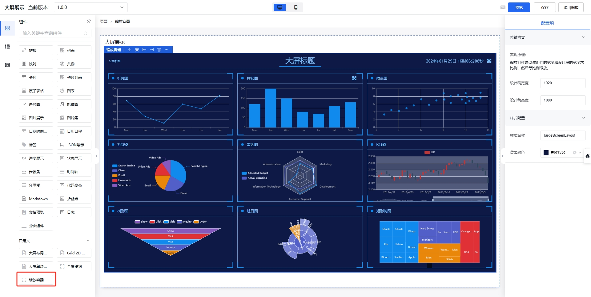

## 缩放容器组件

缩放容器组件主要用于适配不同的尺寸大小，实现原理：**缩放容器组件是以该组件的宽度和设计稿的宽度求比例，然后等比例缩放**。

## 属性表

|名称|字段|用途|默认值|类型|
|----|----|----|----|----|
|设计稿宽度|`uiWidth`|用于计算缩放比例|1920|`number`|
|设计稿高度|`uiHeight`|根据缩放比例，计算高度|1080|`number`|
|样式名称|`className`|定义样式，添加唯一的 `className`，用于全屏配置| largeScreenLayout |`string`|
|背景颜色|`backgroundColor`|设置背景颜色| #0d153d |`string`|
