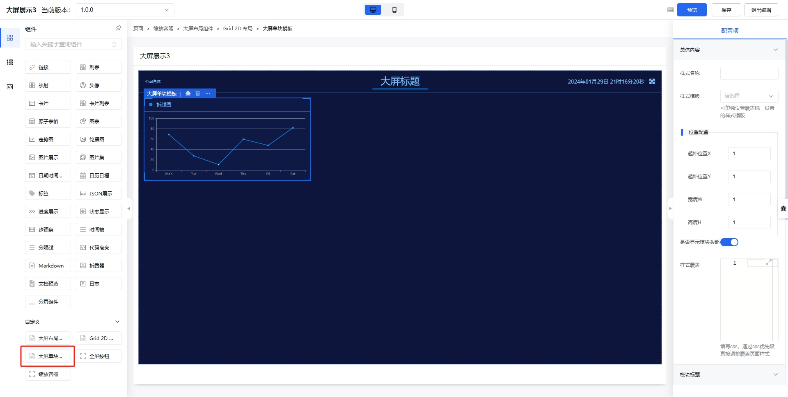

## 大屏单块模板组件



### 总体内容

|名称|字段|用途|默认值|类型|
|----|----|----|----|----|
|样式名称|`className`|定义样式，配置在`fan-screen-card`DOM元素上| - |`string`|
|样式模版|`classStyle`|大屏单块模板的样式模版| - |`string`|
|位置配置|`x/y/h/w`|位置配置| 1 |`number`|
|是否显示头部|`headerShow`|是否显示头部| `true` |`boolean`|
|样式覆盖|`layoutStyle`|填写css，通过css优先级直接调整覆盖页面样式| - ||

#### 样式覆盖 `layoutStyle`

样式覆盖 `layoutStyle` 是通过css优先级直接调整覆盖页面样式，例如：

``` css
.large-screen-layout .large-screen-layout-header {
  height: 100px;
}
```

### 模块标题配置

|名称|字段|用途|默认值|类型|
|----|----|----|----|----|
|标题名称|`headerTitle`|标题名称| - |`string`|
|标题样式|`headerTitleClassName`|定义样式，配置在`fan-screen-card-header_title`DOM元素上| - |`string`|
|字体颜色|`fontColor`|字体颜色，默认从[./layout.md#总体配置](字体颜色) 继承| - |`string`|

### 头部右侧

|名称|字段|用途|默认值|类型|
|----|----|----|----|----|
|右侧内容|`headerRight`|头部右侧，配置[schemanode](https://aisuda.bce.baidu.com/amis/zh-CN/docs/types/schemanode)|-|`json`|
|样式名称|`headerRightClassName`|定义样式，配置在`fan-screen-card-header_right`DOM元素上| - |`string`|

#### 内容配置

|名称|字段|用途|默认值|类型|
|----|----|----|----|----|
|样式名称|`bodyClassName`|定义样式，配置在`fan-screen-card-body`DOM元素上| - |`string`|
|内边距|`bodyPaddingSize`|定义内边距，优先级高于样式名称| - |`number`|

## 大屏单块模板内容

大屏单块模板内容首先嵌套 [Service 功能型容器](https://aisuda.bce.baidu.com/amis/zh-CN/components/service) 用于获取数据，再使用 [Chart 图表](https://aisuda.bce.baidu.com/amis/zh-CN/components/chart) 进行图表渲染。

如果需要轮流高亮 Chart 图表的每个数据，例如 [大屏动态展示](https://jimu.fxss.work/#/outside/echartBigPage2) 可以使用如下配置：

1. 在 [Chart 图表](https://aisuda.bce.baidu.com/amis/zh-CN/components/chart) 上添加唯一的 `className` ；
2. 配置 Chart 图表的 `config` ;
3. 配置 Chart 图表的 `dataFilter`

**`dataFilter`**：

``` js
const curFlag = 'lineCharts';

if (window.fanEchartsIntervals && window.fanEchartsIntervals.get(curFlag)) {
  clearInterval(window.fanEchartsIntervals.get(curFlag)[0]);
  window.fanEchartsIntervals.get(curFlag)[1] && window.fanEchartsIntervals.get(curFlag)[1].dispose();
}

const myChart = echarts.init(document.getElementsByClassName(curFlag)[0]);
let currentIndex = -1;
myChart.setOption({
  ...config,
  series: [
    {
      ...config.series[0],
      data: data.line
    }
  ]
});
const interval = setInterval(function () {
  const dataLen = data.line.length;
  // 取消之前高亮的图形
  myChart.dispatchAction({
    type: 'downplay',
    seriesIndex: 0,
    dataIndex: currentIndex
  });
  currentIndex = (currentIndex + 1) % dataLen;
  // 高亮当前图形
  myChart.dispatchAction({
    type: 'highlight',
    seriesIndex: 0,
    dataIndex: currentIndex
  });
  // 显示 tooltip
  myChart.dispatchAction({
    type: 'showTip',
    seriesIndex: 0,
    dataIndex: currentIndex
  });
}, 1000);

if (window.fanEchartsIntervals) {
  window.fanEchartsIntervals.set(curFlag, [interval, myChart]);
} else {
  window.fanEchartsIntervals = new Map();
  window.fanEchartsIntervals.set(curFlag, [interval, myChart]);
}

return config;
```
