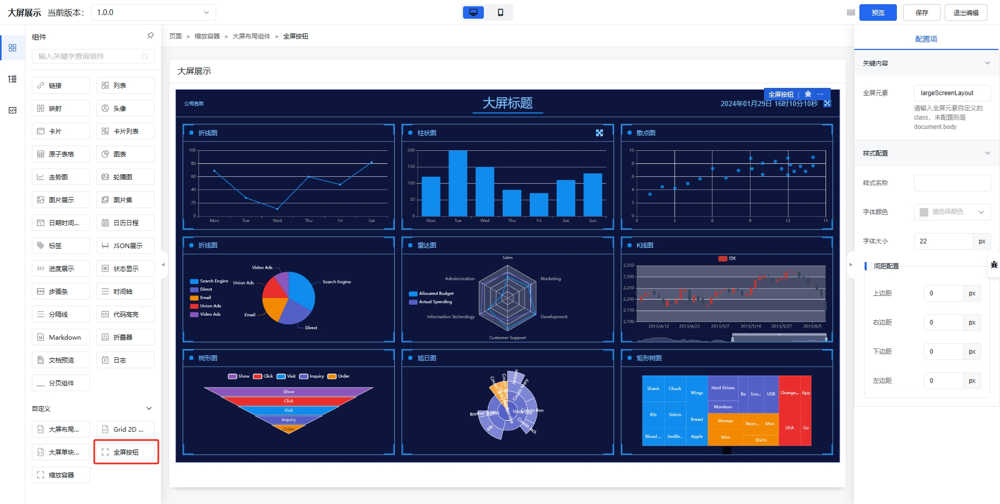

## 全屏按钮组件

全屏按钮组件主要用于配置全屏按钮加全屏元素等。

## 属性表

|名称|字段|用途|默认值|类型|
|----|----|----|----|----|
|全屏元素|`targetClass`|点击按钮时，需要全屏的元素，默认为[缩放容器组件](./scaleBox.md)的`className`：largeScreenLayout| largeScreenLayout |`string`|
|样式名称|`className`|定义样式| - |`string`|
|字体颜色|`fontColor`|字体颜色，未设置时从[大屏布局组件](./layout.md)的字体颜色继承| - |`string`|
|字体大小|`fontSize`|字体大小| 14px |`string`|
|上边距|`paddingTop`|上边距| - |`string`|
|右边距|`paddingRight`|右边距| - |`string`|
|下边距|`paddingBottom`|下边距| - |`string`|
|左边距|`paddingLeft`|左边距| - |`string`|
