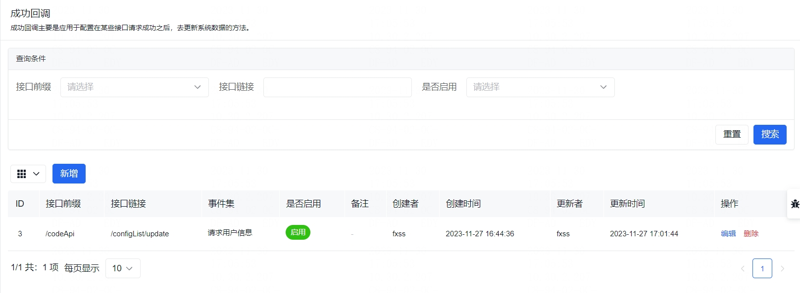
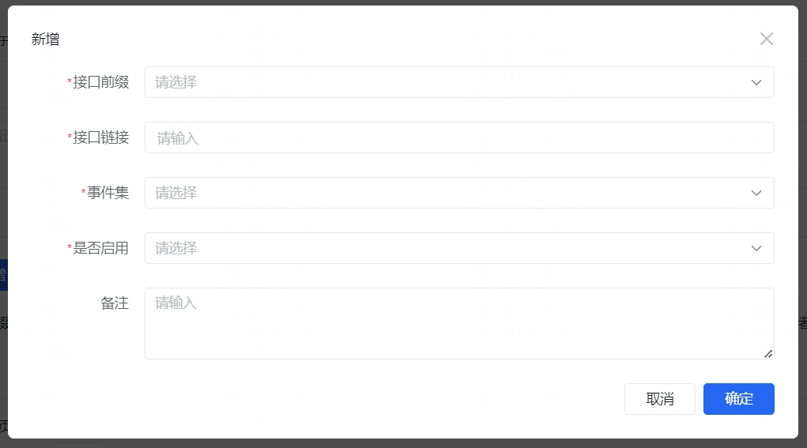

## 用户信息

和本框架对接的时候，有以下几种方式可以获取当前用户信息：

### 页面中的用户信息

所有页面都可以直接在 [数据链](https://aisuda.bce.baidu.com/amis/zh-CN/docs/concepts/datascope-and-datachain#%E6%95%B0%E6%8D%AE%E9%93%BE) 上查找到当前用户信息 `userInfoStore` :

``` js
{
  id: "用户id", // Number
  email: "邮箱", // String
  phone: "手机号", // String
  name: "用户昵称 || 邮箱 || 手机号", // String
  header: "头像", // String
  accessId: "权限id", // Number
  isAdmin: "是否是管理员" // Boolean, true: 是, false: 否
}
```

可以在页面中 `${userInfoStore.x}` (x 代表上述中的 key 值) 使用。

### 接口获取用户信息

不论是前端页面还是后端接口都可以通过 `post` 访问 `https://xxx.xxx.xx/codeApi/getUserInfoApi` （域名为后端接口部署的域名）接口获得当前用户消息：

``` js
{
  id: "用户id", // Number
  email: "邮箱", // String
  phone: "手机号", // String
  name: "用户昵称 || 邮箱 || 手机号", // String
  header: "头像", // String
  accessId: "权限id", // Number
  enable: "当前账户是否可用", // Number，0: 禁用, 1: 启用
  isAdmin: "是否是管理员" // Boolean, true: 是, false: 否
}
```

### 接口获取某个用户的信息

 `post` `https://xxx.xxx.xx/codeApi/getUserInfoApi` （域名为后端接口部署的域名）接口可以指定获取某个用户消息：

参数 `body` ：`{ userId: 用户ID，可选输入，未输入时默认为当前用户 }`，返回结果如下：

``` js
{
  id: "用户id", // Number
  email: "邮箱", // String
  phone: "手机号", // String
  name: "用户昵称 || 邮箱 || 手机号", // String
  header: "头像", // String
  accessId: "权限id", // Number
  enable: "当前账户是否可用", // Number，0: 禁用, 1: 启用
  isAdmin: "是否是管理员" // Boolean, true: 是, false: 否
}
```

## 页面信息

所有页面都可以直接在 [数据链](https://aisuda.bce.baidu.com/amis/zh-CN/docs/concepts/datascope-and-datachain#%E6%95%B0%E6%8D%AE%E9%93%BE) 上查找到当前页面的信息 `pageInfo` :

``` js
{
  id: "页面id", // Number
  key: "页面标识key", // String
}
```

可以在页面中 `${pageInfo.x}` (x 代表上述中的 key(`id/key`) 值) 使用。

## 权限控制

### 页面中的权限信息

所有页面都可以直接在 [数据链](https://aisuda.bce.baidu.com/amis/zh-CN/docs/concepts/datascope-and-datachain#%E6%95%B0%E6%8D%AE%E9%93%BE) 上查找到当前用户信息对当前页面的权限信息 `pageAccess` :

``` js
{
  view: "访问权限", // Boolean, true: 拥有权限, false: 未拥有权限
  editor: "编辑权限", // Boolean, true: 拥有权限, false: 未拥有权限
  delete: "删除权限" // Boolean, true: 拥有权限, false: 未拥有权限
}
```

可以在页面中 `${pageAccess.x}` (x 代表上述中的 key 值) 使用。

### 接口获取页面信息及权限信息

可以在前端、后端调接口 `post` `https://xxx.xxx.xx/codeApi/getPageInfoApi`（域名为后端接口部署的域名） 获取到页面的基本信息和权限信息：

参数为 `body` ：`{ key: 页面标识，必须输入，可以在接口中从页面参数传递 ${pageInfo.key} , userId: 用户ID，可选输入，未输入时则请求接口的 headers 必须包含当前用户的 Authorization`，返回的结果为：

``` js
{
  id: "页面id", // Number
  label: "页面名称", // String
  to: "页面链接", // String
  key: "页面标识", // String
  folder: "页面类型", // Number, 0: 单页面, 1: 目录
  accessIds: "页面访问权限，字符串形式 '1,2,3'", // String
  editorAccessIds: "页面编辑权限，字符串形式 '1,2,3'", // String
  deleteAccessIds: "页面删除权限，字符串形式 '1,2,3'", // String
  enable: "页面是否启用", // Number，0: 禁用, 1: 启用
  version: "页面版本", // String
  pageAccess: { // 针对某个用户的权限（默认为当前用户）
    view: "访问权限", // Boolean, true: 拥有权限, false: 未拥有权限
    editor: "编辑权限", // Boolean, true: 拥有权限, false: 未拥有权限
    delete: "删除权限" // Boolean, true: 拥有权限, false: 未拥有权限
  }
}
```

对接的其他接口可查看 [API接口](./../api/README.md)。

## 系统公共变量

在系统配置中配置的并且启用的 公共变量 所有页面都可以直接在 [数据链](https://aisuda.bce.baidu.com/amis/zh-CN/docs/concepts/datascope-and-datachain#%E6%95%B0%E6%8D%AE%E9%93%BE) 上查找到 `configMap` ，可以在页面中 `${configMap.x}` (x 代表 key 值) 使用。

更详细的使用查看 [系统配置](./configMap.md)。

## 系统方法

系统除了往数据域注入了常用的变量，也向其内注入了一些常用的方法。这里主要使用的 [事件动作 自定义 JS](https://aisuda.bce.baidu.com/amis/zh-CN/docs/concepts/event-action#%E8%87%AA%E5%AE%9A%E4%B9%89-js)：

通过配置`actionType: 'custom'`实现自定义 JS。JS 中可以访问以下对象和方法：

1. `context`，渲染器上下文；
2. `doAction()` 动作执行方法，用于调用任何 `actionType` 指定的动作；
3. `event`，事件对象，可以调用 `setData()`、`stopPropagation()`、`preventDefault()`分别实现事件上下文设置、动作干预、事件干预，可以通过 `event.data` 获取事件上下文。

这里主要使用的是 `context` 或 `event`。

### 重新请求用户信息

无感刷新系统的用户信息 `queryUerInfoFn` ，使用方式如下：

``` json
"onEvent": {
  "submitSucc": {
    "weight": 0,
    "actions": [
      {
        "actionType": "custom",
        "script": "context.props.env.fanjimuFn.queryUerInfoFn()",
        "args": {
        },
        "ignoreError": false
      }
    ]
  }
}
```

或者

``` json
"onEvent": {
  "submitSucc": {
    "weight": 0,
    "actions": [
      {
        "actionType": "custom",
        "script": "event.context.env.fanjimuFn.queryUerInfoFn()",
        "args": {
        },
        "ignoreError": false
      }
    ]
  }
}
```

### 重新请求菜单（包括正式环境和测试环境）

无感刷新系统的菜单 `queryMenuFn` ，使用方式如下：

``` json
"onEvent": {
  "submitSucc": {
    "weight": 0,
    "actions": [
      {
        "actionType": "custom",
        "script": "context.props.env.fanjimuFn.queryMenuFn()",
        "args": {
        },
        "ignoreError": false
      }
    ]
  }
}
```

或者

``` json
"onEvent": {
  "submitSucc": {
    "weight": 0,
    "actions": [
      {
        "actionType": "custom",
        "script": "event.context.env.fanjimuFn.queryMenuFn()",
        "args": {
        },
        "ignoreError": false
      }
    ]
  }
}
```

### 重新请求正式环境菜单

无感刷新系统的菜单 `queryProdMenuFn` ，使用方式如下：

``` json
"onEvent": {
  "submitSucc": {
    "weight": 0,
    "actions": [
      {
        "actionType": "custom",
        "script": "context.props.env.fanjimuFn.queryProdMenuFn()",
        "args": {
        },
        "ignoreError": false
      }
    ]
  }
}
```

或者

``` json
"onEvent": {
  "submitSucc": {
    "weight": 0,
    "actions": [
      {
        "actionType": "custom",
        "script": "event.context.env.fanjimuFn.queryProdMenuFn()",
        "args": {
        },
        "ignoreError": false
      }
    ]
  }
}
```

### 重新请求测试环境菜单

无感刷新系统的菜单 `queryQaMenuFn` ，使用方式如下：

``` json
"onEvent": {
  "submitSucc": {
    "weight": 0,
    "actions": [
      {
        "actionType": "custom",
        "script": "context.props.env.fanjimuFn.queryQaMenuFn()",
        "args": {
        },
        "ignoreError": false
      }
    ]
  }
}
```

或者

``` json
"onEvent": {
  "submitSucc": {
    "weight": 0,
    "actions": [
      {
        "actionType": "custom",
        "script": "event.context.env.fanjimuFn.queryQaMenuFn()",
        "args": {
        },
        "ignoreError": false
      }
    ]
  }
}
```

### 重新请求系统配置

无感刷新系统配置 `queryConfigMapFn` ，使用方式如下：

``` json
"onEvent": {
  "submitSucc": {
    "weight": 0,
    "actions": [
      {
        "actionType": "custom",
        "script": "context.props.env.fanjimuFn.queryConfigMapFn()",
        "args": {
        },
        "ignoreError": false
      }
    ]
  }
}
```

或者

``` json
"onEvent": {
  "submitSucc": {
    "weight": 0,
    "actions": [
      {
        "actionType": "custom",
        "script": "event.context.env.fanjimuFn.queryConfigMapFn()",
        "args": {
        },
        "ignoreError": false
      }
    ]
  }
}
```

### 重新请求成功回调

无感刷新请求成功回调 `querySuccessCallbackFn` ，使用方式如下：

``` json
"onEvent": {
  "submitSucc": {
    "weight": 0,
    "actions": [
      {
        "actionType": "custom",
        "script": "context.props.env.fanjimuFn.querySuccessCallbackFn()",
        "args": {
        },
        "ignoreError": false
      }
    ]
  }
}
```

或者

``` json
"onEvent": {
  "submitSucc": {
    "weight": 0,
    "actions": [
      {
        "actionType": "custom",
        "script": "event.context.env.fanjimuFn.querySuccessCallbackFn()",
        "args": {
        },
        "ignoreError": false
      }
    ]
  }
}
```

### 重新请求系统外观配置

无感刷新系统外观配置 `queryLayoutConfigFn` ，使用方式如下：

``` json
"onEvent": {
  "submitSucc": {
    "weight": 0,
    "actions": [
      {
        "actionType": "custom",
        "script": "context.props.env.fanjimuFn.queryLayoutConfigFn()",
        "args": {
        },
        "ignoreError": false
      }
    ]
  }
}
```

或者

``` json
"onEvent": {
  "submitSucc": {
    "weight": 0,
    "actions": [
      {
        "actionType": "custom",
        "script": "event.context.env.fanjimuFn.queryLayoutConfigFn()",
        "args": {
        },
        "ignoreError": false
      }
    ]
  }
}
```

## 成功回调

成功回调是用于在低代码中某些操作结束之后，无对应的操作事件去执行上面的系统方法时，可以在 **系统设置** / **系统配置** / **成功回调** 内进行配置，配置启用的接口会在调用成功之后，去调用系统方法来达到更新系统数据的目的。





### 成功回调配置的内容

1. 接口前缀：选择接口对应的前缀，前缀取自配置的 [axiosBaseURL](./../config/web.md#axiosbaseurl) ；
2. 接口链接：接口是由类似 `${域名信息}${接口前缀}${接口链接}` 组成，**注意接口链接需要带`/`**；
3. 事件集：对应上面的系统方法，有 请求用户信息、请求系统配置、请求菜单、请求正式环境菜单、请求测试环境菜单、请求成功回调 等事件供选择，选择的事件集会在对应接口成功之后进行依次执行；
4. 是否启用：只有启用的才会在接口成功之后执行，未启用的不执行。
