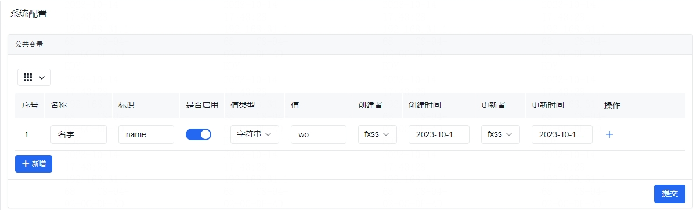
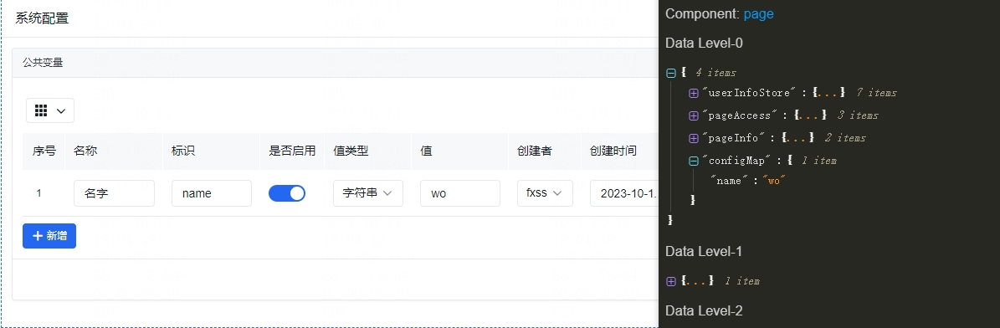

在项目开发的时候，我们经常会设置一些公共变量，以在项目所有的地方进行使用。

## 系统配置

左侧菜单 **系统设置** / **系统配置** 页面内可以配置公共变量。

在这里可以新增配置，配置的标识请使用 英文命名 方式，标识对应下面使用中 `${configMap.x}` 的 `x` ，值类型支持字符串、数值、json，当值类型为 json 格式的时候，输入的值需要自行保证符合 json 格式，否则取值接口会报错。

**只有启用的配置才能在页面中正常使用，尽量不要删除，系统不做变量是否在使用的检测**。

**公共变量不要保存加密隐私信息。**

**公共变量保存成功之后，会自动刷新页面以把公共变量注入到全局。**

## 系统公共变量的使用

启用的公共变量可以在 [数据链](https://aisuda.bce.baidu.com/amis/zh-CN/docs/concepts/datascope-and-datachain#%E6%95%B0%E6%8D%AE%E9%93%BE) 上查找到 公共变量 信息 `configMap` :

可以在页面中 `${configMap.x}` (x 代表 key 值) 使用。
