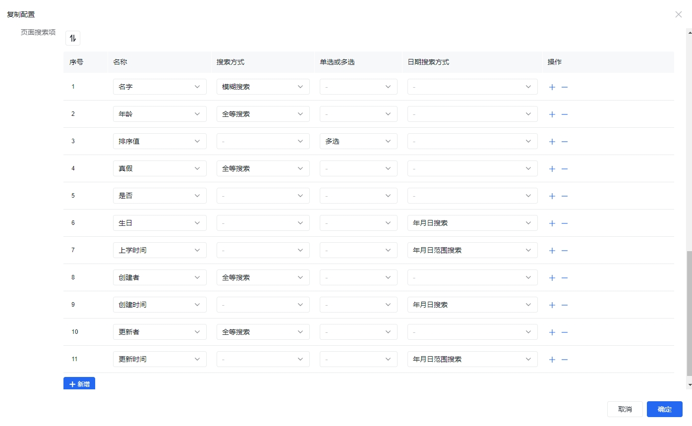

一般项目内很多逻辑都是增删改查的逻辑，所以泛积木-低代码提供了通过配置生成增删改查（会直接生成数据表+页面，并支持配置页面内的搜索内容）。

## CRUD生成器

配置生成增删改查 放在菜单 **系统设置** / **CRUD生成器** 内，我们先看页面内容：


我们可以在页面内新增、查看、复制配置，不支持编辑和删除。并且可以在页面内进行目录、名称、标识等的快速搜索。

从页面上我们可以看出每个CRUD生成器都有3个主要内容，页面信息、数据库表、页面搜索，接下来我们详细查看下：

### 页面信息


首先配置的页面信息和新增页面的时候一样，需要页面所属目录、页面类型、页面名称、页面标识、菜单隐藏、页面启用、页面对外、页面访问权限、页面编辑权限、页面删除权限，**当页面所属目录未填写的时候，会添加在顶层菜单**。

### 数据表信息


上面罗列了一些举例数据，其中名称、中文名称、类型是必填项，各个字段的详细描述如下：

1. 名称：英文驼峰格式，对应数据表字段名称；
2. 中文名称：中文格式，用于页面对应字段的展示；
3. 类型：对应数据表的字段类型，现在支持 `int, float, double, varchar, text, longtext, datetime` 这几种数据结构；
4. 长度：字符串长度，仅类型为 `varchar` 时生效，用于定义数据表字段的长度，并且页面输入框的限制字符长度；
5. 精度：小数位数，仅类型为 `float, double` 之一时生效，类型 `int` 时，精度为 0；
6. 不是null：勾选则不是null，数据表字段必填，页面上表单内的字段也会添加必填校验，接口对应的字段新增的时候也必须必填；
7. 根据当前时间戳更新：对应数据表的根据当前时间戳更新；
8. 注释：对应数据表的注释；
9. 对应数据字典：可选择系统中的数据字典作为下拉选择项，并且页面中会直接引用对应数据字典值；
10. 对应数据：**必须配置为json数据结构，自行保证结构格式**，用于作为下拉选择项，优先级大于 对应数据字典。

对应数据一般用于[下拉框](https://aisuda.bce.baidu.com/amis/zh-CN/components/form/options)，为了方便使用，其`labelField`选项显示字段为`label`，`valueField`选项值字段为`value`，所以以如下结构是最方便使用的：

```json
[
  {
    "label": "显示内容",
    "value": "值"
  },
  {
    "label": "显示内容",
    "value": "值"
  },
  ...
]
```

当然如果要使用其他字段的话也是可以的，例如：

```json
[
  {
    "name": "显示内容",
    "id": "值"
  },
  {
    "name": "显示内容",
    "id": "值"
  },
  ...
]
```

则这个时候需要配置 `labelField` 和 `valueField` 字段，例如 [选项标签字段 labelField](https://aisuda.bce.baidu.com/amis/zh-CN/components/form/options#%E9%80%89%E9%A1%B9%E6%A0%87%E7%AD%BE%E5%AD%97%E6%AE%B5-labelfield)，

```json
{
  "label": "选项",
  "type": "select",
  "name": "select",
  "labelField": "name",
  "valueField": "id",
  "options": [
    {
      "name": "A",
      "id": "a"
    },
    {
      "name": "B",
      "id": "b"
    },
    {
      "name": "C",
      "id": "c"
    }
  ]
}
```

**创建者、创建时间、更新者、更新时间不用添加，系统会自动添加。**

可以通过上下拖拽排序，这里的排序顺序会影响生成的数据表字段的顺序、页面内表格列的顺序、新增编辑表单内的顺序。

### 页面搜索项



上面罗列了一些举例数据，其中名称是必填项，各个字段的详细描述如下：

1. 名称：对应数据表信息内的名称；
2. 搜索方式：`int, float, double, varchar, text, longtext` 类型的搜索方式，支持 全等搜索 和 模糊搜索，不配置则默认为 **全等搜索**；
3. 单选或多选：当数据配置的为 数据字典、对应数据、创建者、更新者 的时候，可以配置单选或多选搜索，不配置则默认为 **单选搜索**，单选或多选搜索都为 **全等搜索**，不支持 模糊搜索；
4. 日期搜索方式：`datetime` 类型的搜索方式，支持 年月日搜索 和 年月日范围搜索，不配置则默认为 **年月日搜索**。

### 页面中的权限说明

1. 新增按钮：拥有页面访问权限即有权限，可以通过 [页面中的权限信息](./abutment.md#页面中的权限信息) 配置调整；
2. 表格操作栏：拥有页面编辑权限或者页面删除权限才会显示，可以通过 [页面中的权限信息](./abutment.md#页面中的权限信息) 配置调整；
   1. 编辑：拥有页面编辑权限才会显示，可以通过 [页面中的权限信息](./abutment.md#页面中的权限信息) 配置调整；
   2. 删除：拥有页面删除权限才会显示，可以通过 [页面中的权限信息](./abutment.md#页面中的权限信息) 配置调整。

## 扩展使用

如果某些数据的录入需要单独在其他页面内，可以在菜单新增页面，将CRUD生成页面内的新增按钮弹窗内的表单代码复制出来，直接放在新页面的 `body` 内，既可以在其他页面进行数据录入。


例如 [测试新增](https://jimu.fxss.work/#/admin/page/testCrudAdd) 页面就是 [测试增删改查](https://jimu.fxss.work/#/admin/page/testCrud) 页面独立出的数据录入。
