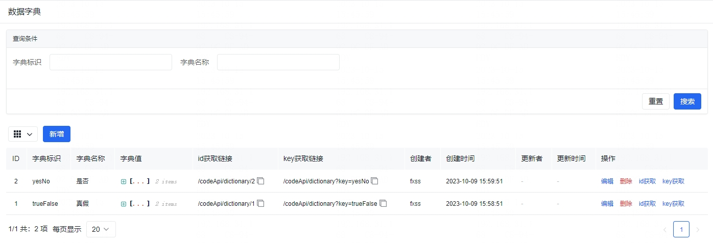
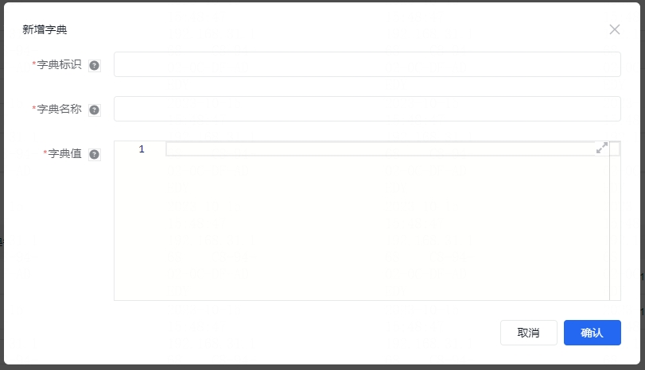

在项目中全局使用的一些字典值的时候，我们可以使用 数据字典，在菜单 **系统设置** / **数据字典**。

## 数据字典

我们可以在 **数据字典** 内新增、编辑、搜索、删除 字典值，支持 字典标识 和 字典名称 两种搜索方式。

新增字典数据的时候，需要填入字典标识、字典名称、字典值，字典标识请设置 **英文驼峰**，字典名称主要是中文名称，字典值对应 json 数据结构。

在界面内我们可以点击操作栏内的 **id获取** / **key获取** ，然后在控制台 Network 内查看 ，这是字典数据提供的两种获取数据的模式，两种获取方式都是 `get` 请求，可以在表格内复制对应的链接。

**建议数据字典使用的时候，以新增为主，尽可能不要删除，防止系统其他地方显示错误。**

**字典数据会被用于某些对外的页面，所以数据内不要包含机密信息。**
