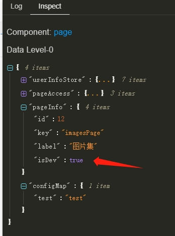

每个需求都需要经过 开发、测试 环境之后我们才能放心的发布到 正式环境，在泛积木-低代码中如何对环境进行区分呢？

开发、测试、正式环境我们采用不同的链接进行标识。

## isDev 开发环境

链接为 `/editor/page/:pageKey` ，也就是项目中的可视化编辑页面，这个时候所处的环境是 dev 环境，会打开 debug 模式，在 预览模式 下可以使用查看各个组件的数据域内的数据。

我们会在数据域内注入 `isDev` 数据：



根据[请求地址可以配置参数](https://aisuda.bce.baidu.com/amis/zh-CN/docs/types/api#%E9%85%8D%E7%BD%AE%E8%AF%B7%E6%B1%82%E5%9C%B0%E5%9D%80)我们可以按照下面的方式进行不同环境调用不同接口。

我们在项目`config.js`配置[axiosBaseURL](./../config/web.md#axiosbaseurl)，针对不同的环境，我们使用不同的 链接前缀，然后在页面 json 的配置内我们可以：

```json
"api": {
  "method": "get",
  "url": "${pageInfo.isProd ? '正式环境接口地址' : (pageInfo.isTest ? '测试环境接口地址' : '开发环境接口地址')}"
},
```

## isTest 测试环境

我们会在数据域内注入 `isTest` 数据：


## isProd 正式环境

我们会在数据域内注入 `isProd` 数据：


