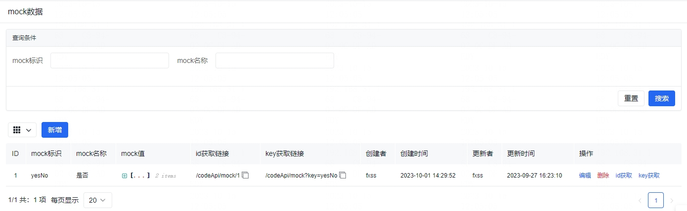
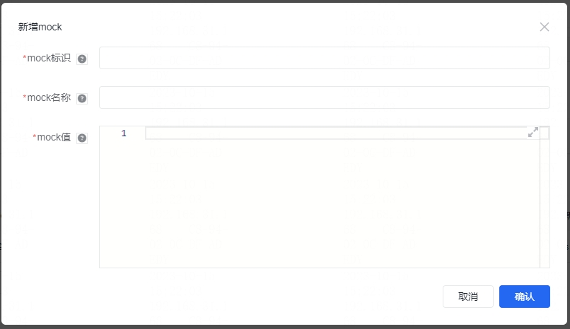

在项目中有的时候接口还没开发好又想配置页面的时候，我们可以使用 mock 数据，在菜单 **系统设置** / **mock数据**。

## mock数据

我们可以在 **mock数据** 内新增、编辑、搜索、删除 mock数据，支持 mock标识 和 mock名称 两种搜索方式。

新增mock数据的时候，需要填入mock标识、mock名称、mock值，mock标识请设置 **英文驼峰**，mock名称主要是中文名称，mock值对应 json 数据结构。

在界面内我们可以点击操作栏内的 **id获取** / **key获取** ，然后在控制台 Network 内查看 ，这是mock数据提供的两种获取数据的模式，两种获取方式都是 `get` 请求，可以在表格内复制对应的链接。
