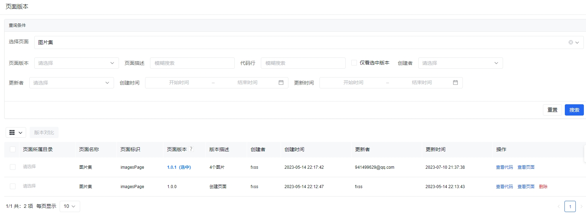
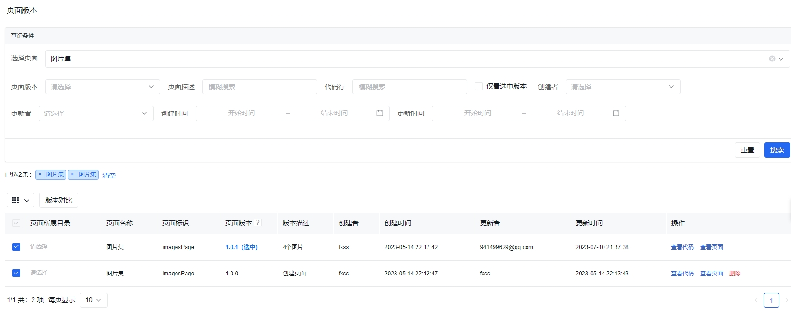
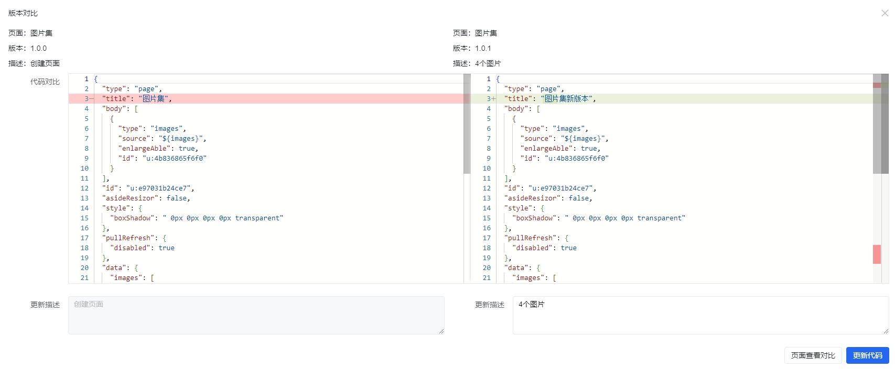
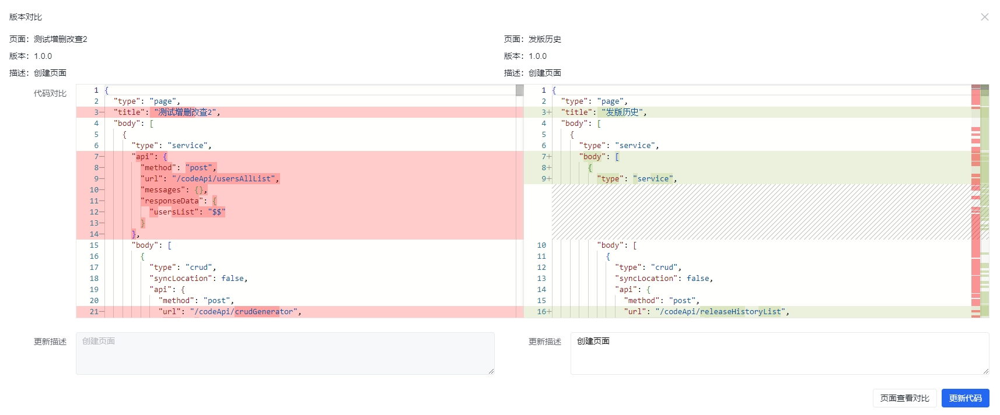
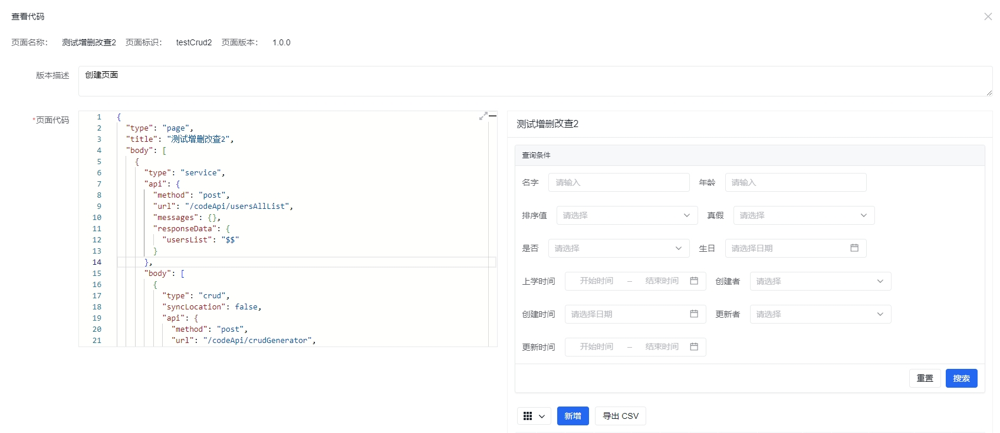
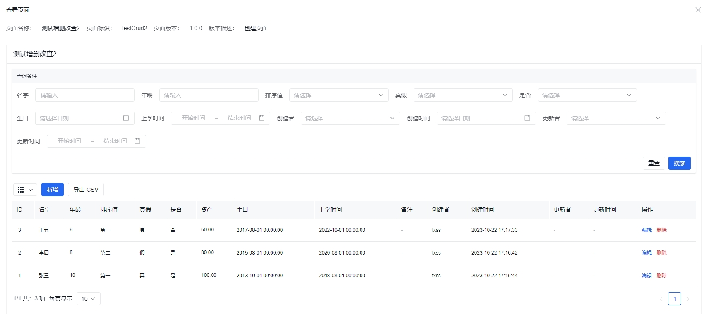

**代码管理** / **页面版本** 提供了查看所有页面版本的功能，可以查看到每个页面对应的线上版本，可以在此页面进行代码对比、查看代码、查看页面、删除页面版本等功能。

## 代码对比

我们可以选择相同页面不同版本、或者是不同页面进行代码对比，

选择页面版本的时候需要注意，**选中的第一项作为对比版本，选中的第二项作为可以调整的版本**。

不同页面进行代码对比，可以把需要复制粘贴的作为对比版本，对比进行调整。

## 查看代码

我们也可以在页面版本页面查看代码，进行调整更新。

## 查看页面

我们也可以在页面版本页面查看页面。

## 删除

只有非选中版本（也就是非正式环境的版本可以删除）。
